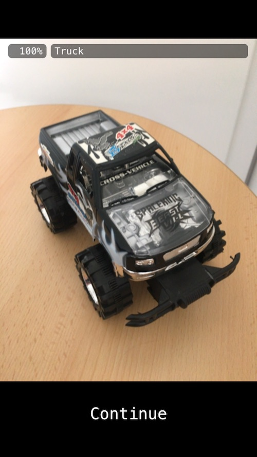
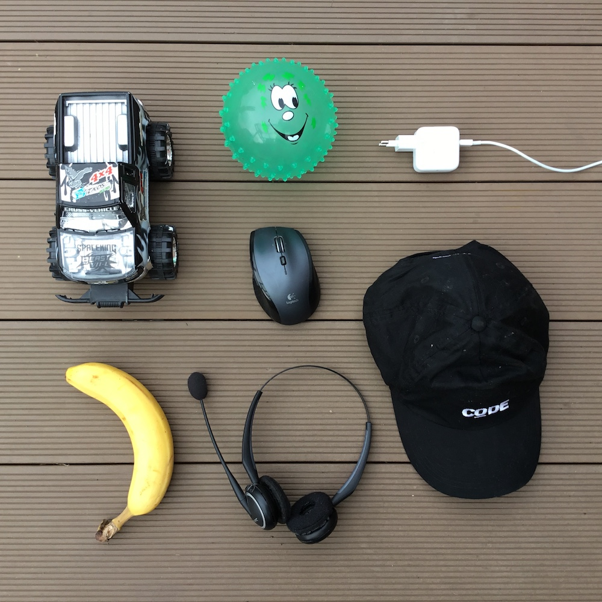

# WORK IN PROGRESS
## Please re-visit soon for the completed code pattern

# Deploying Watson Deep Learning Models to Edge Devices

This project includes sample code how to train a model with [TensorFlow](https://www.tensorflow.org/) and the [Deep Learning service](https://www.ibm.com/blogs/watson/2018/03/deep-learning-service-ibm-makes-advanced-ai-accessible-users-everywhere/) within Watson Studio and how to deploy and access the model on iOS devices.

This is a screenshot from the app running on an iPhone where currently a truck is recognized:



Check out the [video](https://youtu.be/avMQ5VSFb3A) for a quick demo.

In order to train the model I've taken pictures from seven items: plug, soccer ball, mouse, hat, truck, banana and headphones. You can find the images in the [data](data/images) directory.




## Prerequisites

Get a free [IBM Cloud](https://ibm.biz/nheidloff) lite account (no time restriction, no credit card required).

Create an instance of the [Machine Learning](https://console.bluemix.net/catalog/services/machine-learning) service. From the credentials get the user name, password and the instance id.

Install the IBM Cloud CLI with the machine learning plugin and set environment variables by following these [instructions](https://datascience.ibm.com/docs/content/analyze-data/ml_dlaas_environment.html).

Create an instance of the [Cloud Object Storage
](https://console.bluemix.net/catalog/services/cloud-object-storage) service and create HMAC credentials by following these [instructions](https://datascience.ibm.com/docs/content/analyze-data/ml_dlaas_object_store.html). Make sure to use 'Writer' or 'Manager' access and note the aws_access_key_id and aws_secret_access_key for a later step.

Install and configure the AWS CLI by following these [instructions](https://console.bluemix.net/docs/services/cloud-object-storage/cli/aws-cli.html#use-the-aws-cli).


## Training of the Model

Models can be trained either locally, with IBM Watson in the cloud or via Fabric for Deep Learning on a Kubernetes cluster.

In all cases clone this repo, download MobileNet and set up the environment:

```bash
$ git clone https://github.com/nheidloff/watson-deep-learning-tensorflow-lite
$ cd watson-deep-learning-tensorflow-lite
$ my_project_dir=$(pwd)
$ export PROJECT_DIR=$my_project_dir
$ cd data
$ wget http://download.tensorflow.org/models/mobilenet_v1_2018_02_22/mobilenet_v1_0.25_224.tgz
$ tar xvzf mobilenet_v1_0.25_224.tgz
$ cd mobilenet_v1_0.25_224
$ wget http://download.tensorflow.org/models/mobilenet_v1_0.25_224_frozen.tgz
$ tar xvzf mobilenet_v1_0.25_224_frozen.tgz
$ cp -R ${PROJECT_DIR}/data ${PROJECT_DIR}/volume/data
```

### Training with IBM Watson

Create two buckets (use unique names):

```bash
$ aws --endpoint-url=http://s3-api.dal-us-geo.objectstorage.softlayer.net --profile ibm_cos s3 mb s3://nh-recognition-input
$ aws --endpoint-url=http://s3-api.dal-us-geo.objectstorage.softlayer.net --profile ibm_cos s3 mb s3://nh-recognition-output
```

Upload bucket with MobileNet and data (use your unique bucket name):

```bash
$ cd ${PROJECT_DIR}/data
$ aws --endpoint-url=http://s3-api.dal-us-geo.objectstorage.softlayer.net --profile ibm_cos s3 cp . s3://nh-recognition-input/ --recursive
```

Prepare the training:
* Define your object storage credentials and your bucket names in [tf-train.yaml](model/tf-train.yaml).
* Compress [retrain.py](model/retrain.py) into [tf-model.zip](model/tf-model.zip) (only necessary if you change this file).

Invoke the training and check for status (change the generated training name):

```bash
$ cd ${PROJECT_DIR}/model
$ bx ml train tf-model.zip tf-train.yaml
$ bx ml list training-runs
$ bx ml monitor training-runs training-CaXai_DmR
$ bx ml show training-runs training-CaXai_DmR
```

Download the saved model:

```bash
$ cd ${PROJECT_DIR}/saved-model
$ aws --endpoint-url=http://s3-api.dal-us-geo.objectstorage.softlayer.net --profile ibm_cos s3 sync s3://nh-recognition-output .
```

Run these commands (replace the training sub directory name):

```bash
$ cp ${PROJECT_DIR}/saved_model/training-CaXai_DmR/graph.pb ${PROJECT_DIR}/volume/training/graph.pb
$ cp ${PROJECT_DIR}/saved_model/training-CaXai_DmR/labels.txt ${PROJECT_DIR}/ios-photos/data/labels.txt
$ cp ${PROJECT_DIR}/saved_model/training-CaXai_DmR/labels.txt ${PROJECT_DIR}/ios-camera/data/labels.txt
```


### Training with Fabric for Deep Learning

See the [documentation](https://github.com/IBM/FfDL#61-using-ffdl-local-s3-based-object-storage) for details.

Configure S3 by running these commands:

```bash
$ export VM_TYPE=none
$ export SHARED_VOLUME_STORAGE_CLASS="ibmc-file-gold";
$ bx cs workers <cluster_name>
$ export PUBLIC_IP=<Cluster Public IP>
$ node_ip=$PUBLIC_IP
$ s3_port=$(kubectl get service s3 -o jsonpath='{.spec.ports[0].nodePort}')
$ s3_url=http://$node_ip:$s3_port
$ export AWS_ACCESS_KEY_ID=test; export AWS_SECRET_ACCESS_KEY=test; export AWS_DEFAULT_REGION=us-east-1;
$ s3cmd="aws --endpoint-url=$s3_url s3"
```

Create two buckets (use unique names):

```bash
$ $s3cmd mb s3://nh-hunt-input
$ $s3cmd mb s3://nh-hunt-output
```

Upload bucket with MobileNet and data (use your unique bucket name):

```bash
$ cd data/
$ $s3cmd cp . s3://nh-hunt-input/ --recursive
```

Prepare the training:
* Define the public IP of your Kubernetes cluster and your bucket names in [manifest.yml](model/manifest.yml).
* Compress [retrain.py](model/retrain.py) into [tf-model.zip](model/tf-model.zip) (only necessary if you change this file).

Invoke the training and check for status via the web UI (change the public IP):

http://169.62.129.231:31913/#/login?endpoint=169.62.129.231:30383&username=test-user)

Define [manifest.yml](model/manifest.yml) and [tf-model.zip](model/tf-model.zip) and start the training (see [screenshot](documentation/ffdl-training.png)).

Download the saved model:

```bash
$ cd ${PROJECT_DIR}/saved-model
$ $s3cmd sync s3://nh-hunt-output .
```

Run these commands (replace the training sub directory name):

```bash
$ cp ${PROJECT_DIR}/saved_model/training-CaXai_DmR/graph.pb ${PROJECT_DIR}/volume/training/graph.pb
$ cp ${PROJECT_DIR}/saved_model/training-CaXai_DmR/labels.txt ${PROJECT_DIR}/ios-photos/data/labels.txt
$ cp ${PROJECT_DIR}/saved_model/training-CaXai_DmR/labels.txt ${PROJECT_DIR}/ios-camera/data/labels.txt
```


### Local Training

Run the Docker image:

```bash
$ docker run -v ${PROJECT_DIR}/volume:/volume -it tensorflow/tensorflow:1.7.1-devel bash
```

In the Docker container invoke these commands:

```bash
$ python /volume/retrain.py \
  --bottleneck_dir /volume/training/bottlenecks \
  --image_dir /volume/data/images \
  --how_many_training_steps=1000 \
  --architecture mobilenet_0.25_224 \
  --output_labels /volume/training/labels.txt \
  --output_graph /volume/training/graph.pb \
  --model_dir /volume/data \
  --learning_rate 0.01 \
  --summaries_dir /volume/training/retrain_logs
$ exit
```

Run these commands:

```bash
$ cp ${PROJECT_DIR}/volume/labels.txt ${PROJECT_DIR}/ios-photos/data/labels.txt
$ cp ${PROJECT_DIR}/volume/labels.txt ${PROJECT_DIR}/ios-camera/data/labels.txt
```


### Local Training, Watson Traning and Fabric for Deep Learning Training

Run the Docker image:

```bash
$ docker run -v ${PROJECT_DIR}/volume:/volume -it tensorflow/tensorflow:1.7.1-devel bash
```

In the Docker container invoke these commands:

```bash
$ toco \
  --input_file=/volume/training/graph.pb \
  --output_file=/volume/graph.lite \
  --input_format=TENSORFLOW_GRAPHDEF \
  --output_format=TFLITE \
  --input_shape=1,224,224,3 \
  --input_array=input \
  --output_array=final_result \
  --inference_type=FLOAT \
  --input_data_type=FLOAT
$ exit
```

After exiting the container, run these commands:

```bash
$ cp ${PROJECT_DIR}/volume/graph.lite ${PROJECT_DIR}/ios-photos/data/graph.lite
$ cp ${PROJECT_DIR}/volume/graph.lite ${PROJECT_DIR}/ios-camera/data/mobilenet_quant_v1_224.tflite
```


## Deployment of the iOS Apps

Most of the code of this project has been copied from [TensorFlow for Poets 2: TFMobile](https://codelabs.developers.google.com/codelabs/tensorflow-for-poets-2/#0). The tutorial describes how to easily deploy the model to Android devices.

For iOS I've run into some issues (not quantized model and different TensorFlow versions). I've made a few changes to the [iOS photos app](https://github.com/googlecodelabs/tensorflow-for-poets-2/tree/master/ios/tflite) and the [iOS camera app](https://github.com/tensorflow/tensorflow/tree/master/tensorflow/contrib/lite/examples/ios/camera) which you can find in the directories [ios-photos](/ios-photos) and [ios-camera](/ios-camera).

See the TensorFlow [documentation](https://www.tensorflow.org/mobile/tflite/demo_ios) how to install the prerequisites.

Invoke these commands to launch the iOS projects in Xcode.

```bash
cd ${PROJECT_DIR}/ios-camera
pod install
open tflite_camera_example.xcworkspace
```

```bash
cd ${PROJECT_DIR}/ios-photos
pod install
open tflite_photos_example.xcworkspace
```
